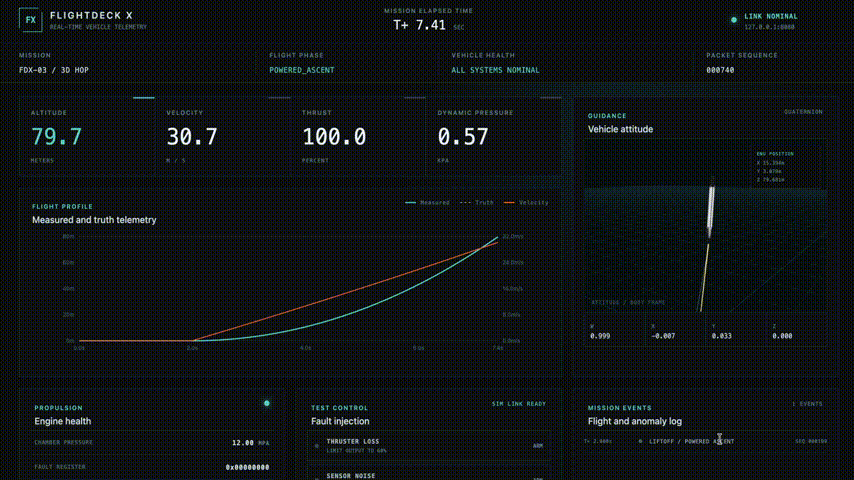
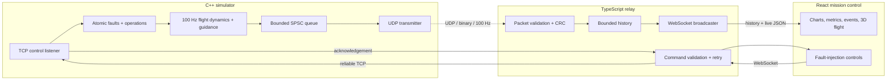

# FlightDeck X

[](https://github.com/santiagomunoz15/flightdeck-x/actions/workflows/ci.yml)

FlightDeck X is a real-time rocket flight simulation and mission-control system
built from first principles. A deterministic C++ simulator flies a guided 2.4 km
hop, transmits binary telemetry at 100 Hz, and drives a browser dashboard with
live plots, health monitoring, fault injection, and an animated 3D vehicle.

```text
C++ flight simulator -> UDP binary telemetry -> TypeScript relay -> WebSocket -> React dashboard
Browser controls      -> WebSocket -> reliable TCP command channel -> simulator
```

The flight dynamics are intentionally simplified. The project focuses on the
software architecture surrounding a flight system: deterministic state updates,
explicit wire contracts, concurrency, data validation, observability, closed-loop
guidance, and operator interaction.

## Demo



## Flight and 3D experience

The simulated booster ascends to a target apogee of 2.4 km, travels toward a
landing target 1 km east and 200 m north of the launch point, coasts, descends,
and performs a guided landing burn. Its ENU position, velocity, normalized
orientation quaternion, propulsion state, sensor measurements, and noise-free
truth state are streamed live to the dashboard.

The Falcon 9-inspired vehicle shown in the dashboard was **completely modeled,
rigged, and animated in Blender by project author Santiago Muñoz**. It is a
purpose-built low-poly asset optimized for real-time browser and mobile
performance; the complete GLB is only **1.3 MB**. The viewer uses the model's
keyframed animations and live telemetry together:

- the vehicle moves at real scale along a retained 3D trajectory trail;
- the camera follows ascent and returns for the landing view;
- engine exhaust scales with commanded thrust and disappears at cutoff;
- landing legs deploy during the final 50–100 m of descent;
- grid fins deploy during descent and deflect with guidance corrections; and
- the center Merlin visually gimbals during powered flight.

## Current capabilities

- Deterministic fixed-step C++ simulation at 100 Hz
- Guided 3D hop with 2.4 km apogee and crossrange landing target
- Versioned 163-byte, big-endian telemetry packets with sequence numbers and CRC32
- Bounded SPSC queue so network I/O cannot block the simulation loop
- UDP telemetry with loss/reordering metrics and deliberate corruption testing
- TypeScript packet validation, bounded history, and multi-client WebSocket fan-out
- Automatic flight reset, reconnect, history backfill, and bounded browser memory
- Live altitude and speed charts, exact-time events, anomaly markers, and residuals
- Quaternion-driven low-poly 3D vehicle, animated mechanisms, plume, trail, and camera
- Acknowledged thrust-loss, sensor-noise, and packet-loss injection
- Simulator-sourced engine-gimbal and grid-fin command telemetry
- Automated C++, TypeScript, socket integration, and production-build checks in CI

## Architecture



Telemetry uses UDP because freshness matters more than retransmitting a stale
flight sample. Fault commands use TCP plus application-level command IDs,
retry, and acknowledgement because commands must arrive reliably and in order.

The simulator maintains separate truth and measured state. Sensor-noise faults
alter measurements while leaving truth untouched, allowing the dashboard to
plot residuals and expose the failure instead of merely changing a status light.

## Technology stack

- **Simulation and networking:** C++20, CMake, POSIX sockets
- **Wire format:** fixed-width binary fields in network byte order
- **Streaming service:** Node.js, TypeScript, UDP/TCP sockets, `ws`
- **Dashboard:** React, TypeScript, Vite, Recharts
- **3D:** Three.js, React Three Fiber, Blender/GLB
- **Tests:** CTest and Vitest, including live localhost socket integration

## Repository structure

```text
flightdeck-x/
  protocol/       Binary telemetry and command specifications
  generator/      Flight simulation, guidance, UDP transmitter, TCP control server
  server/         Packet decoder, bounded history, WebSocket relay, command bridge
  dashboard/      Mission-control UI and 3D flight visualization
  docs/           Engineering decisions, demo guide, and measured test results
  scripts/        One-command development demo supervisor
```

## Run the project

Requirements are CMake 3.20 or newer, a C++20 compiler, and a current Node.js
installation.

```sh
npm install
cmake -S . -B build
cmake --build build
npm run demo
```

Open `http://127.0.0.1:5173`. The relay receives simulator UDP packets on port
5000, serves WebSocket clients on port 8080, and connects to the simulator's TCP
control listener on port 5001. When a flight lands, the dashboard and relay
remain open so the final telemetry can be
inspected. Stop the demo with `Ctrl-C`.

The three processes can also be run separately:

```sh
npm run dev:server
npm run dev:dashboard
./build/generator/flight_simulator
```

Run every local check with:

```sh
cmake --build build
ctest --test-dir build --output-on-failure
npm test --workspaces --if-present
npm run build --workspaces --if-present
```

The simulator also supports a fast, headless flight:

```sh
./build/generator/flight_simulator --no-realtime --no-network --no-control
```

See [the telemetry contract](protocol/telemetry.md), [the control
protocol](protocol/control.md), [engineering decisions](docs/decisions.md), and
[the demo walkthrough](docs/demo.md) for deeper detail.

## Project evolution

These are informal development checkpoints rather than Git tags. They show how
FlightDeck X grew through working vertical slices instead of appearing as one
large final commit.

| Version | Representative upgrade | Checkpoint |
|---|---|---|
| v0.1 — Live telemetry | First complete browser mission-control dashboard, precise charts, CRC-validated streaming, and automatic reconnect | [`7c1e765`](https://github.com/santiagomunoz15/flightdeck-x/commit/7c1e765) |
| v0.2 — Test operations | End-to-end acknowledged fault injection and simultaneous truth/sensor telemetry | [`509293c`](https://github.com/santiagomunoz15/flightdeck-x/commit/509293c), [`2640e50`](https://github.com/santiagomunoz15/flightdeck-x/commit/2640e50) |
| v0.3 — Guided hop | The vertical profile became a guided 2D kilometer hop, then a full 3D flight to a crossrange pad | [`bf3f8a3`](https://github.com/santiagomunoz15/flightdeck-x/commit/bf3f8a3), [`13ef495`](https://github.com/santiagomunoz15/flightdeck-x/commit/13ef495) |
| v0.4 — Custom vehicle | The original low-poly Blender vehicle gained a telemetry plume, real-scale camera, and automatic landing-leg deployment | [`fa0755a`](https://github.com/santiagomunoz15/flightdeck-x/commit/fa0755a), [`ba91618`](https://github.com/santiagomunoz15/flightdeck-x/commit/ba91618) |
| v0.5 — Long-run stability | Browser samples and trajectory geometry were bounded, reducing post-fault-test tab memory to roughly 517 MB in manual measurement | [`b3cf6f1`](https://github.com/santiagomunoz15/flightdeck-x/commit/b3cf6f1) |
| v0.6 — Active flight surfaces | Animated grid fins gained simulator-driven steering and the center engine gained visual gimbal with live command readouts | [`a6ba82b`](https://github.com/santiagomunoz15/flightdeck-x/commit/a6ba82b) |

## Engineering principles

- Units are explicit in protocol fields, code names, charts, and readouts.
- Every queue, history buffer, chart series, and trajectory trail is bounded.
- The fixed-rate simulation does not wait for network or rendering work.
- Truth state, measured state, transmitted state, and displayed state stay distinct.
- Serialization is checked with known-byte fixtures and round-trip tests.
- Commands are validated, acknowledged, and visible to the operator.
- Optimizations are driven by measurements and recorded with focused commits.

FlightDeck X is an educational simulation and portfolio project, not flight
software and not a high-fidelity vehicle model.
