# FlightDeck X

[](https://github.com/santiagomunoz15/flightdeck-x/actions/workflows/ci.yml)

A real-time rocket telemetry and mission-control system built from first
principles. FlightDeck X combines a deterministic C++ flight simulator, a
versioned binary protocol, UDP telemetry transport, a TypeScript streaming
service, and a browser-based mission-control dashboard.

The system is organized into four independent layers:

```text
C++ simulator -> UDP binary packets -> streaming server -> WebSocket -> React UI
```

## Project goals

FlightDeck X explores the engineering decisions behind real-time telemetry
systems rather than hiding them behind high-level abstractions. Its main areas
of focus are:

- deterministic flight-state updates in a fixed-rate simulation loop;
- explicit binary packet layouts with versioning, sequence numbers, and CRCs;
- the tradeoffs between low-latency UDP and reliable WebSocket transport;
- validation, bounded buffering, and distribution of live telemetry;
- quaternion-based 3D orientation without Euler-angle singularities; and
- measurement of latency, packet loss, render rate, and system health.

The flight model is intentionally simplified. The project emphasizes software
architecture, data integrity, concurrency, and observability rather than
high-fidelity aerospace simulation.

## Current capabilities

- Deterministic 100 Hz launch, coast, descent, landing-burn, and touchdown simulation
- Versioned 147-byte binary telemetry with CRC32 and sequence tracking
- Non-blocking SPSC queue and UDP transmission from the simulation thread
- TypeScript validation, 60-second history, and multi-client WebSocket streaming
- Responsive React dashboard with charts, health metrics, and automatic reconnect
- Quaternion-driven 3D vehicle view with a live ENU trajectory trail
- Reliable, acknowledged fault commands for thrust loss, sensor noise, and packet loss
- Mission event timeline and exact-time anomaly markers
- Automated C++, TypeScript, integration, and production-build checks in CI

## Architecture

```mermaid
flowchart LR
  subgraph Generator["C++ generator"]
    SIM["100 Hz flight simulation"] --> QUEUE["Bounded SPSC queue"]
    QUEUE --> TX["UDP transmitter"]
    CONTROL["TCP control listener"] --> FAULTS["Atomic fault state"]
    FAULTS --> SIM
  end

  subgraph Stream["TypeScript streaming server"]
    VALIDATE["Packet validation + CRC"] --> HISTORY["Bounded 60 s history"]
    HISTORY --> WS["WebSocket broadcaster"]
    COMMANDS["Command validation + retry"]
  end

  subgraph UI["React mission control"]
    DASH["Metrics, charts, 3D trajectory"]
    OPERATIONS["Fault controls + event log"]
  end

  TX -. "UDP / 100 Hz binary telemetry" .-> VALIDATE
  WS -->|"JSON history + live samples"| DASH
  OPERATIONS -->|"WebSocket command"| COMMANDS
  COMMANDS -->|"Reliable TCP command"| CONTROL
  CONTROL -->|"Acknowledgement"| COMMANDS
  COMMANDS -->|"WebSocket acknowledgement"| OPERATIONS
```



Telemetry favors freshness and remains non-blocking over UDP. Commands use TCP
and application-level IDs so they can be retained, retried after reconnect, and
acknowledged by the simulator.

## Technology stack

- **Generator:** C++20 and CMake
- **Wire format:** versioned, fixed-width binary packets in network byte order
- **Generator-to-server transport:** UDP
- **Streaming server:** Node.js, TypeScript, and `ws`
- **Browser transport:** WebSockets
- **Dashboard:** React, TypeScript, Vite, React Three Fiber, and Recharts

## Repository structure

```text
flightdeck-x/
  protocol/       Shared packet specification
  generator/      C++ flight simulator and UDP transmitter
  server/         UDP receiver and WebSocket relay
  dashboard/      React mission-control interface
  docs/           Architecture notes and test results
```

## Build and test

The project requires CMake 3.20 or newer and a C++20 compiler:

```sh
cmake -S . -B build
cmake --build build
ctest --test-dir build --output-on-failure
```

See [`protocol/telemetry.md`](protocol/telemetry.md) for the version 1 wire
contract and [`docs/decisions.md`](docs/decisions.md) for the engineering
decisions behind it.

To run a complete flight without real-time delays after building:

```sh
./build/generator/flight_simulator --no-realtime
```

Install the JavaScript dependencies once from the repository root:

```sh
npm install
```

For the complete live system, start each process in its own terminal:

```sh
npm run dev:server
npm run dev:dashboard
./build/generator/flight_simulator
```

Alternatively, after the C++ build exists, launch and supervise all three
processes with one command:

```sh
npm run demo
```

The dashboard is available at `http://127.0.0.1:5173`. The server listens for
simulator UDP packets on port 5000 and serves browser WebSocket clients on port
8080. New clients receive up to 60 seconds of buffered history before live
streaming begins.

For a concise walkthrough of the complete system, see the
[`docs/demo.md`](docs/demo.md) presentation script.

## Development roadmap

Development proceeds through vertical slices, with each milestone producing a
testable path through another part of the system.

### Milestone 1: Define one telemetry packet

The initial protocol contract defines each field before it is consumed by the
simulator or server:

| Field | Type | Unit | Purpose |
|---|---:|---|---|
| magic | `uint32` | — | Identifies a FlightDeck packet |
| version | `uint16` | — | Allows future format changes |
| sequence | `uint32` | — | Detects dropped or reordered packets |
| timestamp_us | `uint64` | µs | Simulator timestamp |
| mission_phase | `uint8` | — | Current flight state-machine phase |
| position | 3 × `float64` | m | Cartesian x, y, z |
| velocity | 3 × `float64` | m/s | Cartesian velocity |
| orientation | 4 × `float32` | — | Normalized quaternion w, x, y, z |
| thrust | `float32` | % | Commanded thrust level |
| chamber_pressure | `float32` | MPa | Engine health value |
| fault_flags | `uint32` | bit field | Active simulated faults |
| truth position | 3 × `float64` | m | Noise-free simulation position |
| truth velocity | 3 × `float64` | m/s | Noise-free simulation velocity |
| crc32 | `uint32` | — | Detects packet corruption |

The contract records byte order, exact packet size, quaternion ordering,
coordinate system, and CRC coverage. Version 1 uses network byte order
(big-endian).

**Checkpoint:** A known-byte fixture and round-trip test prove that serialized
and decoded fields match the contract.

### Milestone 2: Build the C++ simulation loop

The simulator uses a fixed-step loop at 100 Hz (`dt = 0.01 s`) and a simple
two-dimensional East-Up flight model rather than a physically complete rocket:

```text
acceleration = thrust_vector / mass + gravity_vector
velocity    += acceleration * dt
position    += velocity * dt
```

Mission phases are represented as a state machine:

```text
PRELAUNCH -> POWERED_ASCENT -> COAST -> DESCENT -> LANDING_BURN -> LANDED
```

Orientation is represented by a quaternion that is normalized after every
integration step.

The powered-ascent gimbal program builds eastward and northward velocity while
a predicted ballistic-apogee cutoff targets 2.4 km. Bounded aerodynamic control
provides grid-fin-like correction during descent. During the landing burn, a
damped closed-loop controller removes horizontal velocity and guides the vehicle
to a pad 1 km east and 200 m north of launch.

**Checkpoint:** One-second status samples show plausible altitude, velocity,
mass, and mission-phase changes across several stable, deterministic flights.

### Milestone 3: Send and validate UDP packets

Each simulator state is serialized and sent to `127.0.0.1:5000`. A diagnostic
receiver reports sequence number and altitude while validating CRC32 and
tracking packet loss:

```text
packets_lost = current_sequence - previous_sequence - 1
```

A bounded single-producer/single-consumer ring buffer separates the simulation
and network threads so network delays cannot block the simulation loop.

**Checkpoint:** A sustained 100 Hz run records packets sent, received, rejected,
and lost. Deliberately corrupted packets are rejected.

### Milestone 4: Create the streaming server

The TypeScript server will:

1. Listen for UDP telemetry on port 5000.
2. Check packet size, magic, version, CRC, and sequence number.
3. Decode valid packets into a typed internal object.
4. Store the most recent 30–60 seconds in a bounded circular buffer.
5. Serve WebSocket clients on port 8080.
6. Send buffered history when a client connects, then stream live updates.

UDP input remains binary. The first browser-facing WebSocket format uses JSON
for inspectability and will only be optimized if measurements justify it.

**Checkpoint:** Two browser clients receive live data and immediate history
backfill without affecting the simulator rate.

### Milestone 5: Build the dashboard incrementally

The interface is developed in this order:

1. Connection badge and last-packet timestamp
2. Numeric altitude, speed, and mission-phase readouts
3. Rolling altitude, velocity, and dynamic-pressure charts
4. A simple Three.js rocket driven directly by the quaternion
5. Green/amber/red engine and sensor-health indicators
6. Packet loss, end-to-end latency, and rendering FPS metrics

The received normalized quaternion is applied directly to the Three.js model
without conversion to Euler angles.

**Checkpoint:** When the server disconnects, the UI enters a visible disconnected
state, reconnects automatically, and resumes without a page refresh.

### Milestone 6: Add fault injection

A command path from UI to server to simulator introduces three deterministic
faults:

- Thruster loss: reduce available thrust by 40%
- Sensor noise: add seeded noise to one measurement
- Packet loss: deliberately drop every Nth transmitted packet

Every command has an ID, timestamp, acknowledgement, and visible effect. True
simulation state remains separate from noisy sensor measurements so the
difference is observable.

**Checkpoint:** Packet flags, health indicators, plots, and recovery behavior
remain consistent for every injected fault.

## Engineering principles

- Units remain explicit in field names and protocol documentation.
- Monotonic clocks measure durations; wall clocks are reserved for display.
- Every queue and history buffer is bounded.
- Truth state, sensor state, and displayed state remain separate.
- Serialization is tested against known byte fixtures as well as round trips.
- Measurements guide optimization, with results recorded in `docs/`.
- Passing milestones are captured in focused commits.

## Definition of done

The project is complete when it can simulate a full flight, stream at 100 Hz,
recover cleanly from disconnects, backfill new clients, visualize orientation
and plots, inject faults, and report measured latency and packet loss without
blocking the simulation loop.
